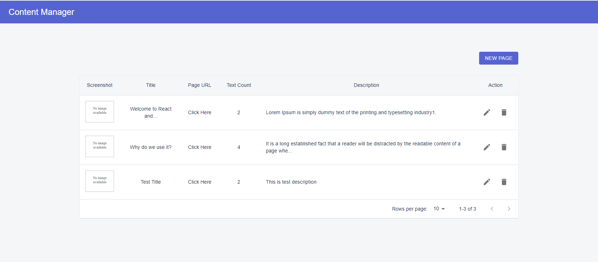

<h2 align="center">Next.js SPA Content Management System</h2>



## Live Website

- <a href="https://ecstatic-lovelace-2beaf0.netlify.app/" target="_blank">Click Here</a>

## Solution

- [Click Here](./SOLUTION.md)

## Features

- **Create New Page** - Create page with title and description
- **Update Page Details** - Update Page details
- **Delete Page** - Delete Page from DB
- **Create New Text** - Create text with key and value
- **Update Text Details** - Update text details
- **Delete Text** - Delete Text from DB
- **Search by Page title** - Enables the user to search page by title.
- **Loading Spinners** - Enables multiple loading spinners when browser load events from API

## About

This is a simple but enterprise-ready content management app created from [Next.js](https://nextjs.org/) by [Daniel](https://github.com/danieljindev/).

> [Click Here](./assets/Screenshot.png) to see more in details.

## Application Installation

Clone and install.

```bash
git clone https://github.com/danieljindev/next-content-manager.git
cd next-content-manager
yarn install
```

Run a development server.

```bash
yarn dev
```

- **Application name**: Content Manger
- **Homepage URL**: `http://localhost:3000`
- **Deployed Server URL**: [Click Here](https://ecstatic-lovelace-2beaf0.netlify.app/)

#### Development mode

Go to `localhost:3000` to view the app.

```bash
yarn start
```

#### Production mode

In the production environment, the React app is built and saved to `build` folder.

```bash
yarn build && yarn start
```

## Author

- [Daniel Jin](https://github.com/danieljindev/)
